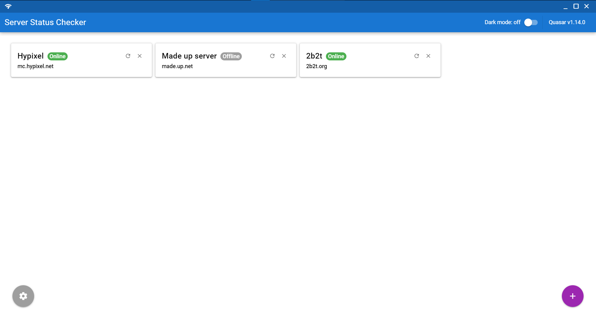
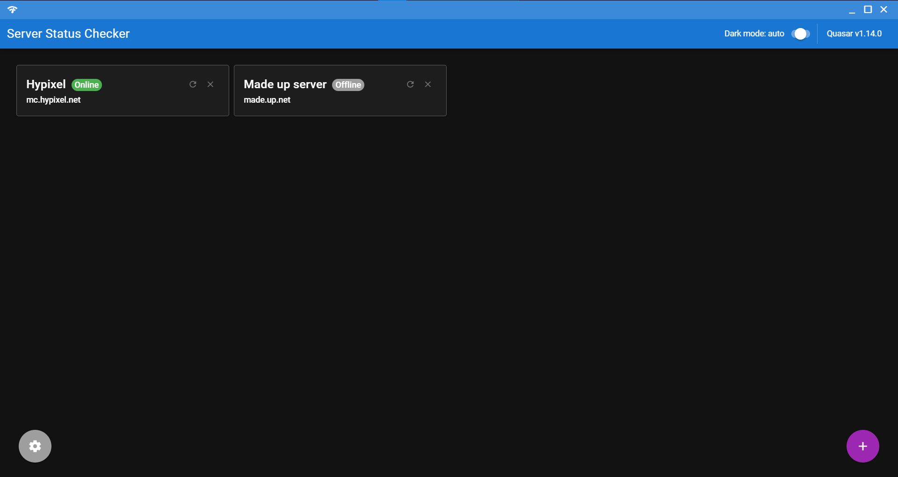

# Server Status Checker (server-status-checker)

This is an application written using the Quasar Framework ([click here for more details](https://quasar.dev/)) to act as an example of a simple front-end that queries an API. The main purpose is to simply query minecraft servers which have been added to the application, and display their online status.

As this is a project I originally coded to get to know Quasar, there are probably many bugs and bad practises, so don't assume that everything here is the best and most correct way to do things.

## Images

All the images of the application running are stored in the 'images' folder, here are a few just to show how the application looks running:

#### Small screen:


#### Big screen:



#### Dark mode:



## Running the app

To run the application (assuming I have actually uploaded the built files), simply download the latest files from the release page and run the executable file. It should start up and work.

- To change values, click on that value in the card and type in your new entry.
- To add new cards, use the the plus button at the bottom right.
- To delete cards, click the cross at the top right of the card.
- To refresh a card, click the refresh button at the top right.
- To change the frequency the servers refresh at, click the settings button in the lower left.

## To build the app youself

If there is not a release or you would like to build for a different platform or you just want the experience, follow the steps below:

1. Make sure Quasar-CLI is installed, instructions for which are [here](https://quasar.dev/quasar-cli/installation) as well as yarn, which you can get by running `npm install --global yarn`.
2. In a terminal at the root of the project directory, run the following commands:

```bash
# Install the dependencies
yarn

# (Optional) lint the files
yarn run lint

# Build the project
yarn run build

# Build the project for a specific version
quasar build -m electron -T [darwin|win32|linux|mas]
```

3. Grab the files from /dist/electron/MC Server Status Checker-...
4. Run the executable inside

If any of this doesn't work, it may be worth having a look at the official docs [here](https://quasar.dev/quasar-cli/developing-electron-apps/build-commands).
